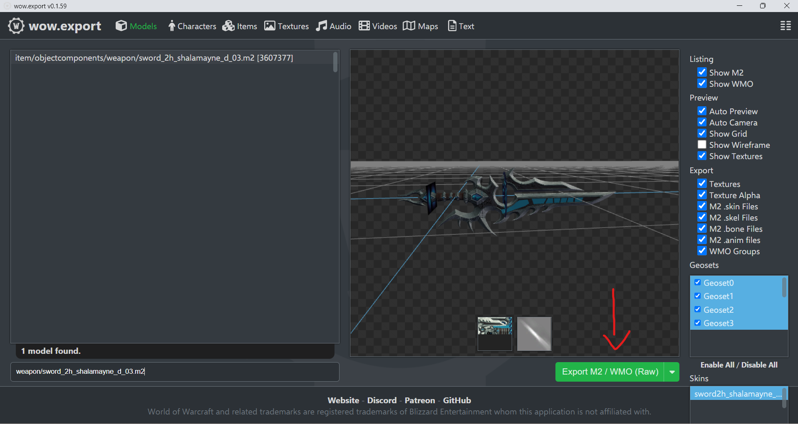
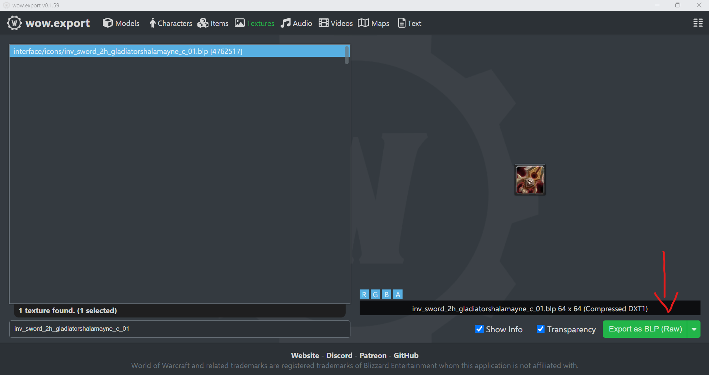

# Before We Begin

1) Before we begin this tutorial I am going to tell you have to install and set up M2mod and blender M2i addon. If you downloaded the tools from my link M2mod comes with the tools. All you would have to do is set it up to your computer. To do this open M2mod click on file -> settings set up your mappings directory. Which would be the M2mod folder because it has the listfile we are going to be using. Make sure you click save.

2) Okay so before you can install the blender addon you need to go to https://download.blender.org/release/Blender2.79/ and download blender 2.79. 

3) Now that we have blender 2.79 downloaded. Go to https://bitbucket.org/suncurio/blender-m2i-scripts/downloads/?tab=tags and download the addon v9.0.0. Before we can install the addon in blender unzip everything in the zip file. You will then have a readme.md and a WoWTools folder. You are then going to want to zip the WoWTools folder. 

4) Alright now that all of that is done. Open up blender 2.79. In the top left corner you will see an I icon click. In the dropdown menu you will see User Prefrences and click that. Click on Install Add-on From File once the menu is open navigate to the location of the WoWTools.zip. Click on WoWTools.zip and Install Add-on from file. If the Add-on is not enabled click and enable it. Then once it's enabled click on Save User Settings. Now blender 2.79 is set up to import/export m2i files.

5) You are going to need any database editor. Navicat/HeidiSql is are good onese. You will also need database access which you should have if you are reading this tutorial. Or if you have TrinityCreator or Keira debating on which core you have. 

6) Last but not least if you didn't download the tools I provided from https://drive.google.com/file/d/1yJ89gDPUe1kuJ6kThjZHX15JwxYjKs3H/view?usp=sharing go ahead and do this now unless you have your own tools. Which is great also. 

# Retroporting An Item

    Okay before we start this section of the tutorial is on how to retroport an item. Meaning either armor/weapons/shields. If you're going to follow along with this tutorial you can either use the exact model I am using or you can use a model you want to port.

1. Open up WoW.Export once it's open and you choose the 10.2.5/10.2.6 type in the search bar item/weapon/sword_2h_shalamayne_d_03.m2. This is the weapon we are going to use for this tutorial. Click on the button that says Export M2 / WMO (RAW). It will say successfully exported model you can either click the blue show file button or navigate to the wow.export folder in C:\Users\Your User\WoW.Export\Item\ObjectComponents\Weapon. (Also go to the textures tab of wow.export and type in interface/icons/inv_sword_2h_gladiatorshalamayne_c_01.blp. Side note this may not be the right item icon for this)

     

2. Okay so now that we have the weapon we want to port export its time to run it through M2Mod. Open up M2mod then Tools -> TXID Remover. This will bring up a menu that will say m2 path. Click on the button with the three ... and open your m2 in there then click on convert. (If it's your first time opening M2mod it will freeze for a few seconds this is normal) Once it's done converting it'll prompt you to save thee file. Do so

3. Now that we have the new m2 from TXID under M2 -> M2i in the source M2 section select the M2 file. Once you select it press okay and then the button Go! will become clickable click on that button. If successful on the bottom it will say Export Done. 

4. Click on the next tab M2i -> M2 you shouldn't have to select anything should be preselected this model doesn't require us to go into blender and change anything in bleder. You are going to click on Preload. Once it's done preloading you are going to want to click on the button Go! once it becomes clickable. 

5. Once it says Import successful you are going to want to navigate to your item folder. In there should be a new folder calld Export. Go into that folder and cut and paste the contents of the export folder back into the item folder. Then you are going to want to delete the export folder. 

6. Before we continue you can either delete or leave the .json file and the m2i file. Okay if you did that optional step its fine if not it is fine. Now you are going to want to go to your multiconverter. If you're using my tools navigate to the folder called Porting Tools. Inside this folder there is a sub folder called MultiConverter-TXID go into that folder. Then in there you have 3 sub folders also open up Multiconverter. Once in that folder open up MultiConverter Shadowlands-Wotlk.exe. Once the converter opens up take all the contents of the item folder that we just ran through M2mod and drag into the converter. Click on fix once it's fixed nothing should appear in the converter. 

7. Now that we converted it to 3.3.5 there is a few more steps before we can get the model into the game. Go back to my tools and open up in game modifers. Inside this folder you will have 4 folders. 3 incase of green which is a blp to png/png to blp converter(This is if when your retroport armors and the texturecomponents part of the armor is showing green in game), Cracked 3.3.5 Client which is a folder that has a Wow.exe in it that allows for more than 4gb of ram to be used and i believe it also enables it not to create a cache folder, MPQ Editor which allows you to open .mpq files and make new ones, and last but not least WDBXEditor which allows you to dit .dbc files. The last thing in this folder is StoneHarry's Spell Editor if you want to install in just click on the exe and itll extract it to whereever you want it extracted to. 

8. Go into the MPQ Editor folder x64 and run the MPQEditor.exe. Once it opens make a new mpq file. Named it patch-I.mpq for this tutorial. Click on next and where it says Game Compatibility click on change and select World of Warcraft Wrath of the Lich King. Then click on next. For max amount put this value 256954. Okay then it should open up your mpq file. 

9. Okay so now you are going to want to click on the button that says new folder. Name it DBFilesClient this is the folder we are going to put our dbc files in. Once it's created on the left you will see two folders click on the one that has C:\ or whatever the drive is that you the mpq editor in. It ill bring you back out and you'll will now see the folder DBCFilesClient. Next go back to your item folder from wow.export. Navigate all the way back to where the main folder is item. Now drag and drop that folder into the patch. You will also wanna drag the Interface folder into the patch as well this contains the item icon. (Do not close out of MPQEditor)

10. So now we need to navigate and locate our itemdisplayinfo.dbc this is typically in your servers core folder where the worldserver.exe is located. Or if you're a dev on a server you will have access to this via a patch file that the server owner gave you. Now open up WDBX Editor. Once this program is opened File -> Open and open the itemdisplayinfo.dbc. Make a new entry in the column ModelName_1 put this sword_2h_shalamayne_d_03.mdx. Then go to column ModelTexture_1 put this sword_2h_shalamayne_d_03_3607739 (you do not need to add the .blp extension). Finally go to InventoryIcon_1 and put inv_sword_2h_gladiatorshalamayne_c_01 (again you don't ned to put the extension). After all this is done ctrl + s to save the file. 

11. Open up Keira/Trinity Creator you are going to want to create an item. Once you're at creating a new item class is going to be 2 and subclass is going to be 8(this is for a two handed sword). Where is says display id put the id of the entry we just put into itemdisplayinfo.dbc. For quality the options are grey(0), white(1), green(2), blue(3), purple(4), legendary(5), red(6), gold(7(but this requires the item to have flags 134221824 which makes the item bind on account)). Select any rarity you want for this I am going 4 which is and epic item. Buy price/Sell price is completely creator prefrence. 1 is copper 100 (1 silver) 1000(1 gold). For inventory type we are going to set it to 17 which is two handed. Max count is only if you want to make the item have a max amount that a player can equip or have in inventory at once. I am going to set this to one. The next two options we are not going to touch which are stackable and startquest. In material you are going to want to put 1 which is metal. Random property, RandomSuffix, Bagfamily, containerslots, tomtemcategory, duration, itemlimitcat, disenchatid, foodtype, minmoneyloot, maxmoneyloot, itemset are not going to be touched. For this tutorial bonding is going to be set to 1 which is bind on pick up. You don't have to touch Flags, Flagsextra, flagscustom, pagetext, pagematerial, langid don't need to be touched for this tutorial. Next Itemlevel you can set this to any ilevel you want wont effect anything. Req.level set to whatever level you want the item to be used at. I am not adding any stats to this weapon for me because it's for transmog purposes. When you are done you are going to want to excute the the query if using trinity creator or keira. if you are doing this via database editor just click off the line and it'll save. (Don't forget to set your sheathe type to 1)

12. Okay now that we have our item created so we don't qet question mark errors or melee weapon must be equipped error go to item.dbc. Once opened you are going to want to make a new line change the id of the line to your item entry id. classid is 2 and subclass id is 8, sound_override to -1 and material to 1, displayinfoid to your itemdisplayinfo entry for the item. inventory type is 17 and sheathe is 1. then save the file.

13. Back go to MPQ Editor go into your DBCFiles client folder and drag those two dbc files into there and close the file. Once this is done don't forget to go back into your servers dbc files if you exported them from a patch and update them. If you opened the dbc files from the servers dbc you are fine. Now you are going to want to restart your server which will add your item into the game. 

14. Once the server is restarted load up your game log in and add yourself your newly retropted item. 

# Retroporting Creatures

1. Open up WoW.Export once it's open and you choose the 10.2.5/10.2.6 type in the search bar creature/taurenprimalist_light/taurenprimalist_light.m2. Or you can choose any model of your liking. For this tutorial I am going to be using this model. Extract either this model or the model of your choice.

2. Now that we have the extracted creature we want to retroport open up M2mod. Go to tools -> TXID Fix -> Load the creature m2 from the extraction folder. Once it's TXID Fixed go to M2 -> M2i and selected your creatures M2 files and Hit Go!. This creature doesn't need anything changed in the m2i stage so we are going right to M2i -> M2 and converting it back into M2. Hit preload wait for it to perload then hit GO!.

3. Go to the export folder of M2mod which should be in the creatures folder with the M2 called export. You should see the m2 and all the .skin files all the ones that have _lod you want to rename them and removed the _lod. Example Taurenprimalist_light_lod01 goes to taurenprimalist_light01(side note if the base skin already as an 01 go to the next number 02 etc).

4. Now that we changed the names of the skin files. Open the creature M2 in 010 editor and run Alastor's M2 template which you can install in the templates section of 010 editor. Once it loads in template results click the drop down and search for nviews. With our model by default it is set to 1 we are going to want to change that to the number of skin files we have. In this case the nviews value will change from 1 to 4. Once you change the value save the M2 file.

5. Back in the export folder you are going to want to cut everything in the there so the skins and the m2 and paste it in the default creature folder. So in the taurenprimalist_light folder. It will ask you to replace 2 files which is the uneditd m2 and skin file. Hit replace

6. Next we are going to want to open up our multiconverter and drag and drop everything in and hit the convert button.

7. Okay so now we are going to open up two dbc files creaturemodeldata and creaturedisplayinfo. Inside of CreatureModelData we are going to look for Character\Tauren\Male and copy this line into a new line. We are not going to use this model but this will help us with model size and some creature sounds by default. We are going to change the ModelName to Creature\TaurenPrimalist_Light\TaurenPrimalist_Light.mdx then we are going to save this (Make sure you right down the entry number of this model). Now go into CreatureDisplayInfo and make a new line. Okay once you have a new line in ModelID you put the id of the line in CreatureModelData SoundID 0, ExtendDisplay 0, CreatureModelScale 1, CreatureModelAlpha 255, Nothing else needs to be touched for this model save the file.

8. Next we are going to but the creature folder and these dbcs into a custom patch. Go into the MPQ Editor folder x64 and run the MPQEditor.exe. Once it opens make a new mpq file. Named it patch-C.mpq for this tutorial. Click on next and where it says Game Compatibility click on change and select World of Warcraft Wrath of the Lich King. Then click on next. For max amount put this value 256954. Okay then it should open up your mpq file.

9. Okay so now you are going to want to click on the button that says new folder. Name it DBFilesClient this is the folder we are going to put our dbc files in. Once it's created on the left you will see two folders click on the one that has C:\ or whatever the drive is that you the mpq editor in. It ill bring you back out and you'll will now see the folder DBCFilesClient. Now in this folder you're going to want to drag and drop your dbc files into here. Then we are going to go out of the DBCFilesClient folder. Go to your wow.export directory which should be in users/username/wow.export in whatever drive your main one is. You'll see a folder called creature you are going to want to drag that into your patch. You should have two folders DBCFilesClient and Craeture. Exit the patch. (Side not both dbc files have to be in your servers dbc files)

10. Next is database work.....Okay first we are going to go into creature_model_info and make a new entry here were are going to just copy the last line and change the entry value to the value of the display in creaturedisplayinfo. Then this step is done.

11. Then we are going to go and create a new creature and we are going to give it the new custom display. (If you don't know how to create a new creature just copy any entry an just change the display id of the new entry created. I can create a tutorial for that if everyone really wants me to.)

12. Okay now we are just going to want to restart the server. Once it's restarted add the creature and it should work.
